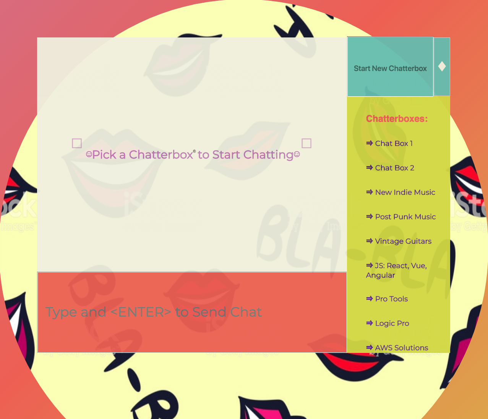
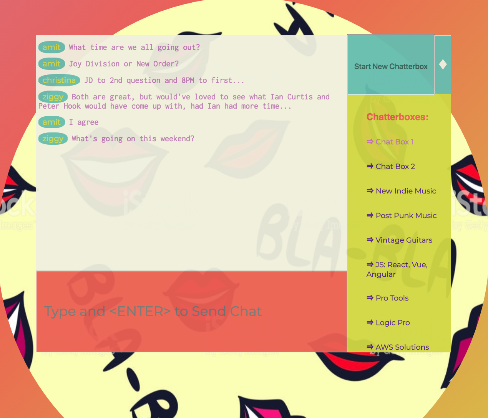
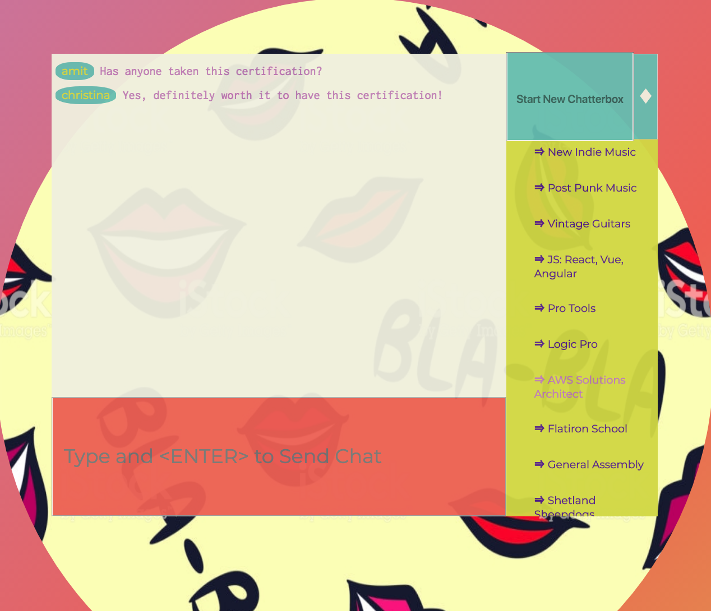

This project was bootstrapped with [Create React App](https://github.com/facebookincubator/create-react-app).

# [ChatterBox](https://chatterbox-react.herokuapp.com/)
#### Please Click App Name Above to View Heroku Deployment
 

  

  
  

#### Technologies Used:
##### REACT
##### Pusher-Chatkit
##### Heroku

#### This App was created with React and an API called ChatKit.  Chats can be created, and the user can enter and exit multiple Chat Boxes, each with their own subjects, and can converse with users.  Additionally, a user can create new Chat Boxes to discuss subjects that they are interested in.  For the Heroku deployment, the user "ziggy" is the only user that is active.

#### To see the app's Heroku deployment, click the ChatterBox name/link above or you can view the app [here](https://chatterbox-react.herokuapp.com/).

##### [Amit](https://amitzaman.com/)
